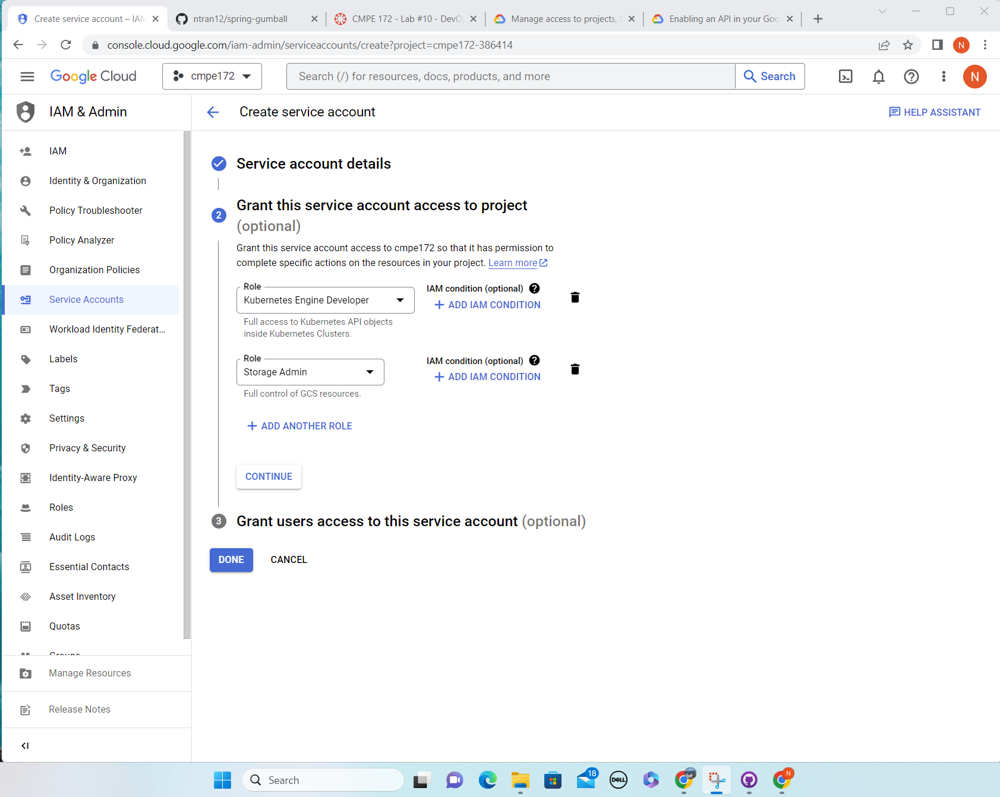
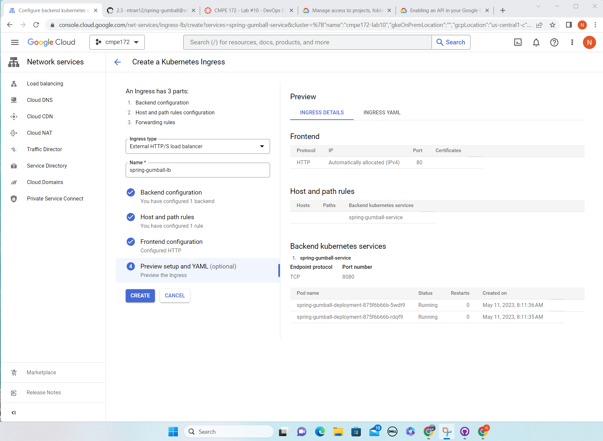

## CMPE 172 - Lab #10 Notes

### CI Workflow (Part 1)
- Create my public repo which is name spring-gumball
  

- After creating repo, upload provide code into my repo

- Go to actions option, choose new workflow by configure "java with Gradle"
  

- Then it will generate the file in the .github/gradle.yam

- In deployment.yaml, change replicas into 2, insteads of 4

- After that, click on the process and check the code which is running through CI

- Screenshot after builing succesful
  

### CD Workflow (Part 2)
- Set up the project and cluster
  

- Next is enabling the container register and google kubernetes engine API
  

- Go to IAM, choose service account options, then create a new service and generate new key

  

- Then add add grant access for spring-gumball service : Kubernetes engine developer and storage admin
  

- Same as CI workflow, I Go to actions option, choose new workflow by configure "Build and Deploy to GKE"
  

- Then it will generate the file in the .github/google.yaml

- Change the name of project ID and cluster in google.yaml file

- Then go to setting option, add key which I generate in spring-gumball service and GKE_PROJECT ID

  

- Trigger a CD deployment by creating a new 2.3 gitHub release

  

- Then creating Kubernetes ingress, named spring-gumball lb, choose spring-gumball-service for backends, http port is set as 80

  

- Creating Kubernetes ingress sucessfully
  

- Check workload, service, ingress, load balancer, everything look good.

  

- Display spring-gumball page
  

